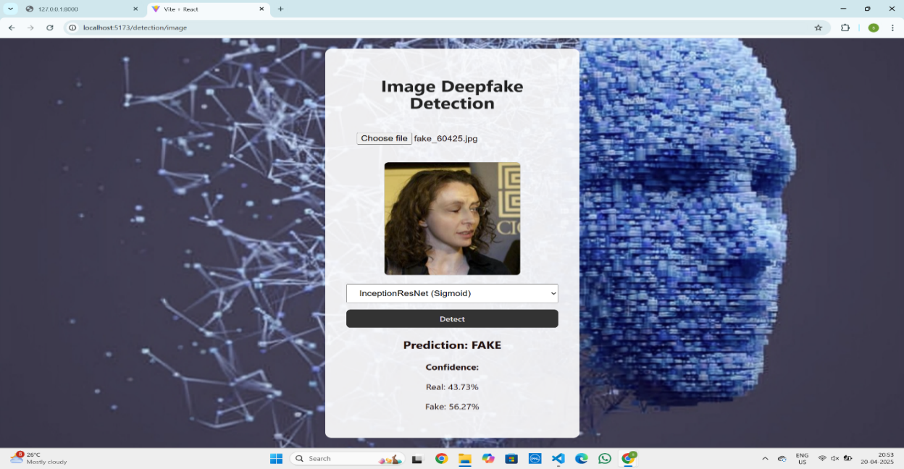
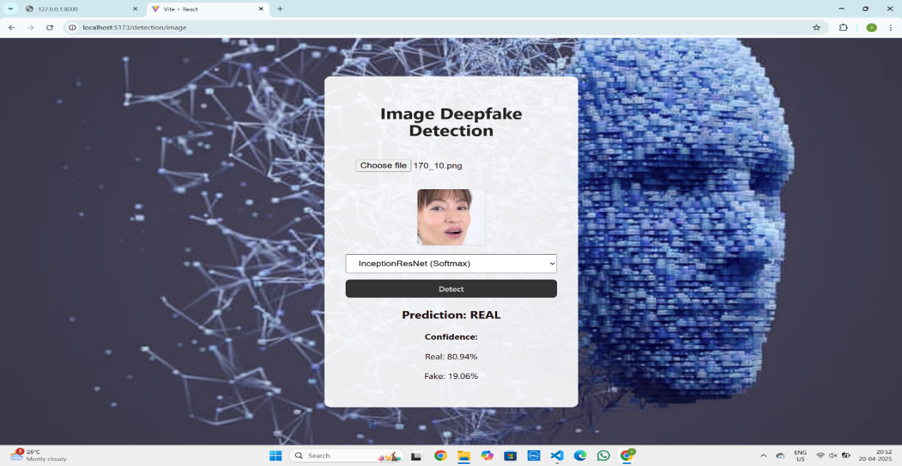
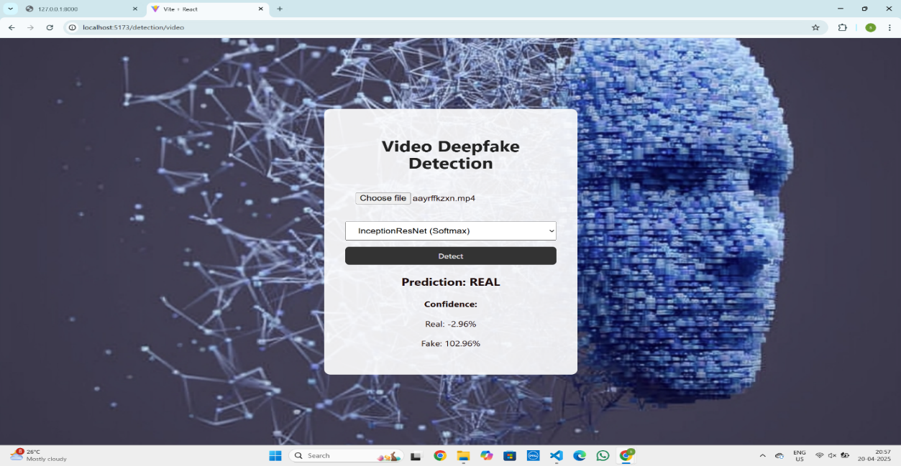

# 🧠 DeepFakeGuard: A Robust Framework for Detecting Synthetic Media in Images and Videos

## 📌 Overview
**DeepFakeGuard** is a machine learning and deep learning–based system designed to detect synthetic (AI-generated) images and videos.  
This project focuses on identifying manipulated visual media using pre-trained models, ensuring authenticity in multimedia content.

> ⚠️ Note: Model weights are not included in this repository due to confidentiality.  
> The code demonstrates the full framework and pipeline structure.

---

## 🎯 Features
- Detects fake vs. real media (images and videos)
- Utilizes pre-trained deep learning models for high accuracy
- Modular pipeline for easy model replacement or fine-tuning
- Supports both batch and real-time processing
- Detailed logs and output visualization

---

## 🧩 Tech Stack
| Component | Technology Used |
|------------|----------------|
| Programming Language | Python |
| Deep Learning Framework | TensorFlow / PyTorch |
| Computer Vision | OpenCV |
| Pre-trained Models | CNN / Xception / EfficientNet |
| Supporting Libraries | NumPy, Matplotlib, Scikit-learn |

---

## 🧠 Architecture
1. **Data Preprocessing** – Frame extraction, resizing, normalization  
2. **Feature Extraction** – Using CNN-based pretrained models  
3. **Classification Layer** – Fake/Real prediction  
4. **Visualization** – Heatmaps and bounding boxes (for analysis)  
5. **Result Storage** – Saves reports, processed frames, and logs  

---

## 📊 Example Output
Below is a sample output from the system.


## 🖼 Sample Outputs

Below are example results (public demo only):

| Frame Example 1 | Frame Example 2 | Frame Example 3 | Frame Example 4 | Frame Example 5 |
|------------------|------------------|------------------|------------------|------------------|
|  |  |  |  |  |


---

## 🚀 How to Run
> Note: Since model weights are not shared, this project will not run end-to-end.  
> However, you can follow these steps to understand or extend the system.

```bash
# 1️⃣ Clone the repository
git clone https://github.com/<your-username>/DeepFakeGuard.git
cd DeepFakeGuard

# 2️⃣ Install dependencies
pip install -r requirements.txt

# 3️⃣ Run main file (example)
python main.py
